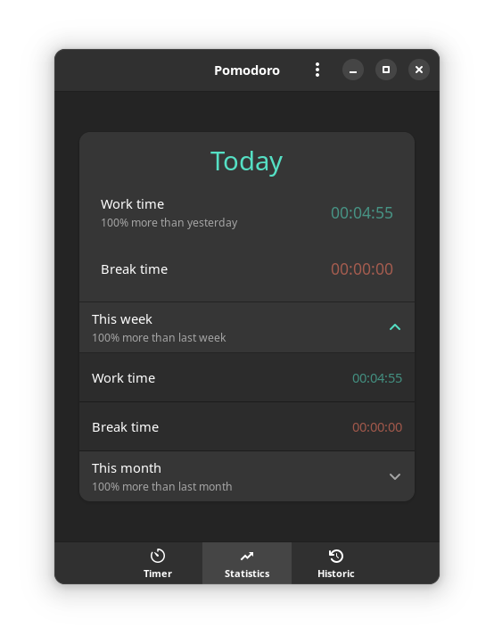
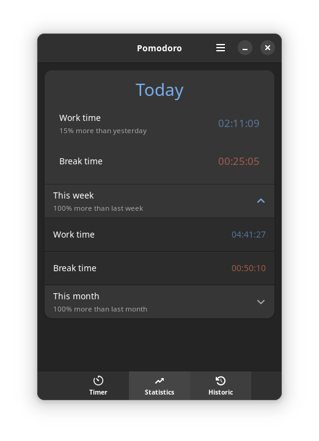
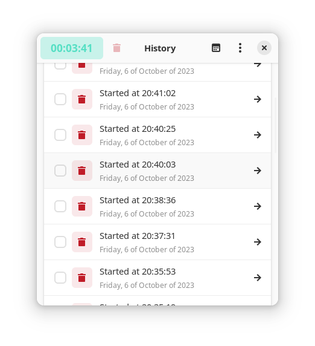

<<<<<<< HEAD
Pomodoro
=======

## A simple timer application, its main objective is to be simple, and intuitive.
### Home page, here you create a title and a description and start the timer in a simple and quick way.

### Here you have access to a quick statistics panel.

### Here you have the History of all your Pomodoros.

I'm also on youtube, all the steps to build this app are there.
==========
### Youtube playlist: https://www.youtube.com/playlist?list=PLCWMX5EFKy29tHWr3i7BfJ_eIi8HDAc45

Help me continue to bring updates and improvements to this app and others.
==========
### My Ko-Fi: https://ko-fi.com/idevecore

Any doubts, contact me:
=========
### Email: ideve.core@gmail.com
### Email: francisco.jeferson.dev@gmail.com

Copyright 2023 Ideve Core
=====
Pomodoro is released under the terms of the GNU General Public License, either
version 3.0 or, at your option, any later version.
=======
# pomodoro

A description of this project.
>>>>>>> new-pomodoro
