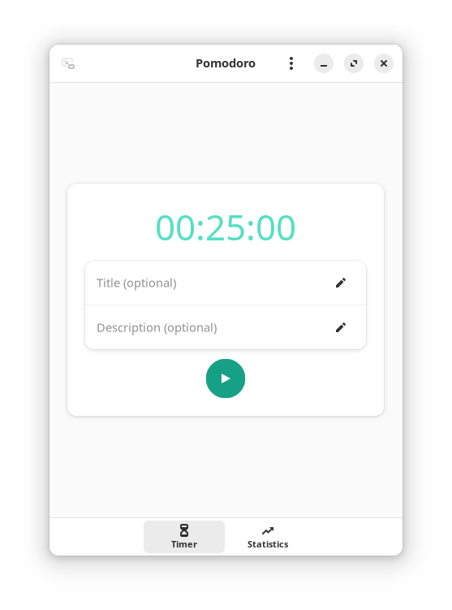

# Pomodoro

A simple timer application, its main objective is to be simple, and intuitive.



## Features
- History
- Statistics
- Run in background
- Feedback sounds
- Progress notification

## Flathub
<a href='https://flathub.org/apps/io.gitlab.idevecore.Pomodoro'></a>

## Building

###  Requirements
- Gjs `gjs` 
- GTK4 `gtk4` 
- libadwaita (>= 1.2.0) `libadwaita`
- Meson `meson` 
- Ninja `ninja` 
- D-Bus `python-dbus`

### Building from Git
```bash 
 git clone --recurse-submodules https://gitlab.com/idevecore/pomodoro.git
 cd pomodoro
 meson builddir --prefix=/usr/local 
 sudo ninja -C builddir install 
 ```

## Translations

[](https://hosted.weblate.org/engage/pomodoro/) ✨Powered by [Weblate](https://weblate.org/en/)✨

Pomodoro has been translated into the following languages:

<a href="https://hosted.weblate.org/engage/pomodoro/">

</a>

Please help translate Pomodoro into more languages through [Weblate](https://hosted.weblate.org/engage/pomodoro/).

## Donate
If you like this project and have some spare money left, consider donating:

### Ko-fi or Patreon
<a href='https://ko-fi.com/idevecore'></a>
<a href='https://patreon.com/IdeveCore'></a>

## License 
 [GNU General Public License 3 or later](https://www.gnu.org/licenses/gpl-3.0.en.html)
